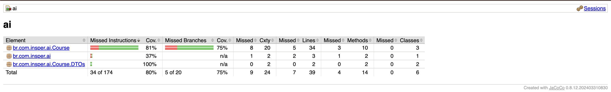
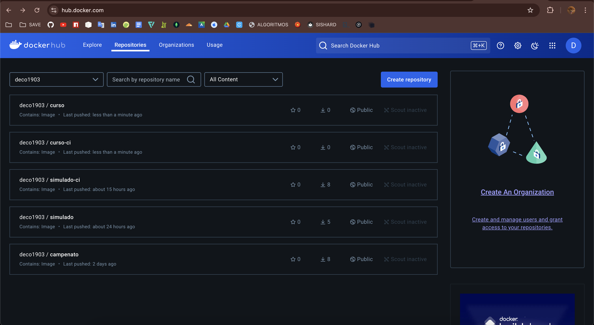
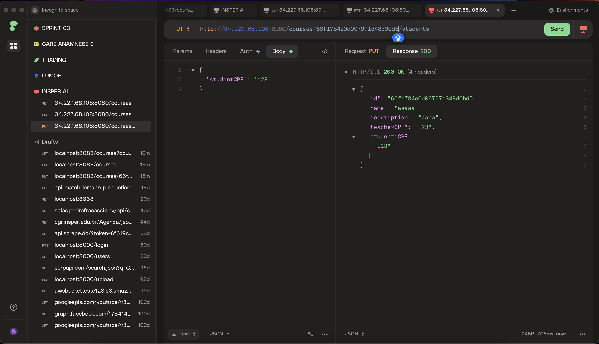
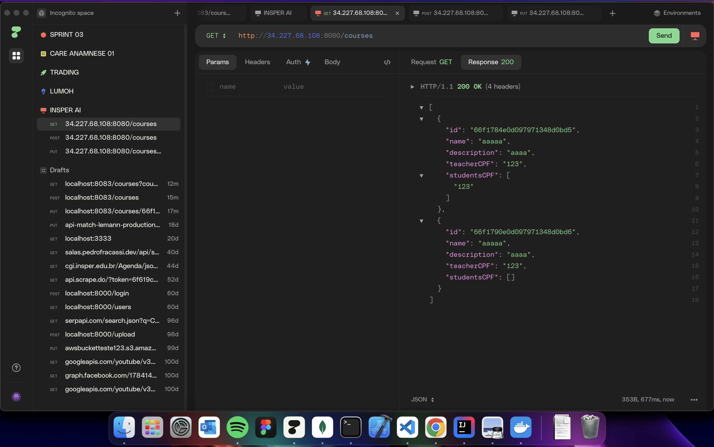
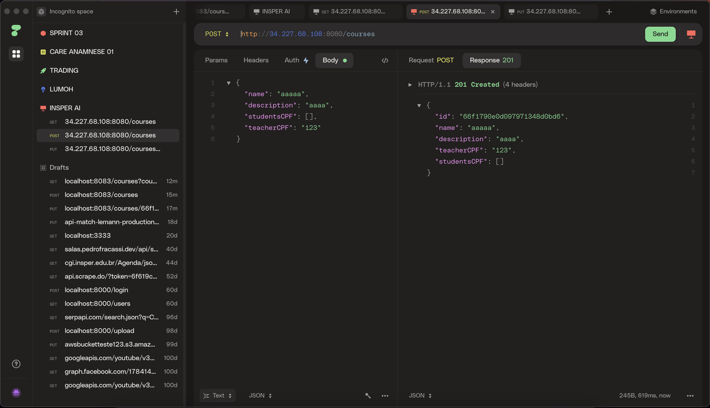

# COBERTURA DE TESTES

# DOCKER HUB

- https://hub.docker.com/repository/docker/deco1903/curso/general
- https://hub.docker.com/repository/docker/deco1903/curso-ci/general

# HTTPie - deploy (http client)

- IP da máquina: **34.227.68.108:8080**

